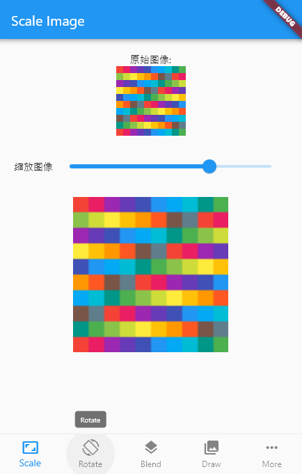

# BufferImage
[](https://pub.dartlang.org/packages/buffer_image)

A library for modify and display rgba format image data.


## preview

demo code:
```
// create ImageProvider
BufferImage bufferImage = BufferImage(100, 100);
for (int i = 0; i < 100; i++) {
    for (int j = 0; j < 100; j++) {
    bufferImage.setColor(
        i, j, Colors.primaries[(i * 100 + j) % Colors.primaries.length]);
    }
}
image = RgbaImage.fromBufferImage(bufferImage, scale: 1);
bufferImage.resize(2);
scaleImage = RgbaImage.fromBufferImage(bufferImage, scale: 1);


// display Image
Center(
    child: Column(
        mainAxisAlignment: MainAxisAlignment.spaceAround,
        children: <Widget>[
        Image(
            image: image,
        ),
        Image(
            image: scaleImage,
        ),
        ],
    ),
)
```


## Features
- [x] BufferImage for edit the pixel image
- [x] ImageProvider for display in Image Widget
- [x] Scale the image (Nearest sample mode and Bilinear sample mode is available)
- [x] Color/Image mask with a blend mode
- [x] Rotate
- [x] drawRect drawImage
- [x] clipPath drawPath
- [ ] ImageProvider optimize
- [ ] any more...

## Flutter

This project is a starting point for a Dart
[package](https://flutter.dev/developing-packages/),
a library module containing code that can be shared easily across
multiple Flutter or Dart projects.

For help getting started with Flutter, view our 
[online documentation](https://flutter.dev/docs), which offers tutorials, 
samples, guidance on mobile development, and a full API reference.
