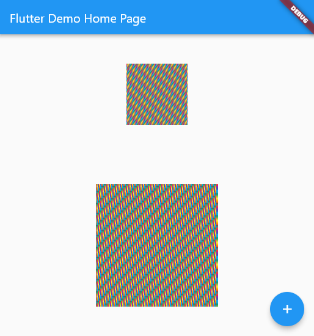

# buffer_image
[](https://pub.dartlang.org/packages/buffer_image)

用于编辑及显示原始像素格式(rgba)图片的库.


## 效果预览

完整代码参考example
```
// 生成ImageProvider
BufferImage bufferImage = BufferImage(100, 100);
for (int i = 0; i < 100; i++) {
    for (int j = 0; j < 100; j++) {
    bufferImage.setColor(
        i, j, Colors.primaries[(i * 100 + j) % Colors.primaries.length]);
    }
}
image = RgbaImage.fromBufferImage(bufferImage, scale: 1);
bufferImage.resize(2);
scaleImage = RgbaImage.fromBufferImage(bufferImage, scale: 1);


// 显示Image
Center(
    child: Column(
        mainAxisAlignment: MainAxisAlignment.spaceAround,
        children: <Widget>[
        Image(
            image: image,
        ),
        Image(
            image: scaleImage,
        ),
        ],
    ),
)
```


## 功能
- ✅ 处理原始图像格式的类(像素设置，图片缩放)
- ✅ 处理图片显示的provider
- ✅ 图片缩放的插值算法 (实现了邻近算法和二次插值)
- ✅ 颜色，帖图混合模式
- ✅ 旋转图像(还需要增加抗锯齿算法)
- ✅ 画方块 画图像
- ✅ 路径裁剪 画路径
- ✅ 灰度图
- 🚧 ImageProvider 优化
- 🚧 更多图像编辑方法

## Flutter

This project is a starting point for a Dart
[package](https://flutter.dev/developing-packages/),
a library module containing code that can be shared easily across
multiple Flutter or Dart projects.

For help getting started with Flutter, view our 
[online documentation](https://flutter.dev/docs), which offers tutorials, 
samples, guidance on mobile development, and a full API reference.
